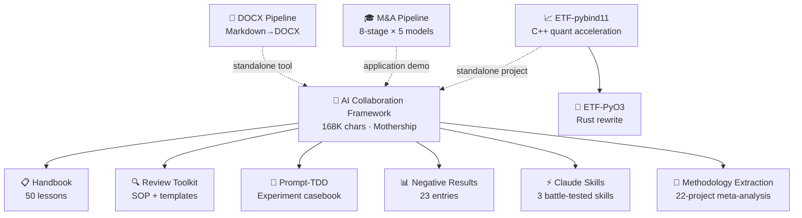

> [简体中文](README.md) | English | [正體中文](README.zh-Hant.md)

### Hi, I'm redamancy231 👋

**I build reproducible Human-AI collaboration frameworks, quantitative engineering tools, and multi-model LLM review pipelines.**

All 11 repos are battle-tested through cross-model independent review.

All repos are trilingual (zh-CN / zh-Hant / EN). Each language is a standalone file, cross-linked via the language bar above.

---

## 🚀 Projects

### Methodology

| Project | What it is | Status |
|------|------|:--:|
| [**AI 协作框架**](https://github.com/redamancy231-create/ai-collaboration-framework) | Full-lifecycle Human-AI collaboration framework — 3 controlled experiments + 50+ rounds of cross-model review | active |
| [**Methodology Handbook**](https://github.com/redamancy231-create/methodology-handbook) | 50 battle-tested lessons at a glance — the "error logbook" companion | published |
| [**Prompt-TDD Methodology**](https://github.com/redamancy231-create/prompt-tdd-methodology) | Prompt experiment casebook — includes 2 real experiment results (negative results published) | published |
| [**M&A Case Study Pipeline**](https://github.com/redamancy231-create/ma-case-study-pipeline) | 8-stage multi-model academic pipeline — double-blind cross-review + open/closed-book experiment | demo |
| [**Methodology Extraction Methodology**](https://github.com/redamancy231-create/methodology-extraction-methodology) | Meta-level methodology extraction experiment — systematic extraction from 22 projects | maintenance |

### Review & Quality Assurance

| Project | What it is | Status |
|------|------|:--:|
| [**Independent Review Toolkit**](https://github.com/redamancy231-create/independent-review-toolkit) | Multi-model independent review SOP · Prompt templates · Adversarial challenge framework | published |
| [**Negative Results Registry**](https://github.com/redamancy231-create/negative-results-registry) | AI Collaboration Negative Results Registry — 23 entries × 10 domains, a structured database of "AI experiments that failed" | active |

### Dev Tools

| Project | What it is | Status |
|------|------|:--:|
| [**DOCX Pipeline**](https://github.com/redamancy231-create/docx-pipeline) | Markdown → high-quality Chinese DOCX — dual backend + Mermaid rendering + 4 templates | published |
| [**Claude Skills**](https://github.com/redamancy231-create/claude-skills) | 3 battle-tested Claude Code Skills — session handoff · CLAUDE.md authoring · pre-emptive veto | published |

### Quant Engineering

| Project | What it is | Status |
|------|------|:--:|
| [**ETF Pattern Match — pybind11**](https://github.com/redamancy231-create/etf-pattern-match-pybind11) | pybind11/C++20 accelerated quant strategy core — DTW 34× / pattern matching 53× | published |
| [**ETF Pattern Match — PyO3**](https://github.com/redamancy231-create/etf-pattern-match-pyo3) | Rust/PyO3 rewrite of ETF pattern matching — API-compatible with C++ original, NRR-2026-023 C++ vs Rust full comparison | published |

---

> **Solid lines** = derived/extracted from the AI Collaboration Framework. **Dashed lines** = standalone tools or application demos.

---

## 📖 Start Here

- **New to Human-AI collaboration?** → [AI 协作框架](https://github.com/redamancy231-create/ai-collaboration-framework)
- **Want battle-tested lessons at a glance?** → [Methodology Handbook](https://github.com/redamancy231-create/methodology-handbook)
- **Designing prompt controlled experiments?** → [Prompt-TDD Methodology](https://github.com/redamancy231-create/prompt-tdd-methodology)
- **Looking for review SOPs and prompt templates?** → [Independent Review Toolkit](https://github.com/redamancy231-create/independent-review-toolkit)
- **Want to see "what doesn't work" in AI experiments?** → [Negative Results Registry](https://github.com/redamancy231-create/negative-results-registry)
- **Need Markdown → DOCX with Chinese typography?** → [DOCX Pipeline](https://github.com/redamancy231-create/docx-pipeline)
- **Want battle-tested Claude Code Skills?** → [Claude Skills](https://github.com/redamancy231-create/claude-skills)
- **Interested in quant engineering?** → [ETF Pattern Match — pybind11](https://github.com/redamancy231-create/etf-pattern-match-pybind11) (C++ original) or [ETF Pattern Match — PyO3](https://github.com/redamancy231-create/etf-pattern-match-pyo3) (Rust rewrite)
- **Building academic pipelines with LLMs?** → [M&A Case Study Pipeline](https://github.com/redamancy231-create/ma-case-study-pipeline)
- **Curious about methodology extraction?** → [Methodology Extraction Methodology](https://github.com/redamancy231-create/methodology-extraction-methodology)

---

## 📫 Let's Connect

- 💬 Open to collaboration on reproducible AI-assisted research and quant engineering tooling
- 🐛 Found a bug or have a suggestion? Open an issue on the relevant repo
- ⭐ If you find my projects useful, consider starring them

---

> [简体中文](README.md) | English | [正體中文](README.zh-Hant.md)