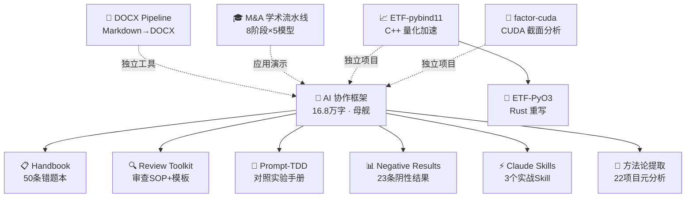

> 简体中文 | [English](README.en.md) | [正體中文](README.zh-Hant.md)

### Hi, I'm redamancy231 👋

**我构建可复现的人类-AI协作框架、量化工程工具和多模型 LLM 审查管道。**

12 个仓库均经过跨模型独立审查的实战验证。

所有仓库均为三语（zh-CN / zh-Hant / EN），每种语言独立文件，通过语言栏交叉链接。

---

## 🚀 项目

### 方法论

| 项目 | 简介 | 版本 | 状态 |
|------|------|:--:|:--:|
| [**AI 协作框架**](https://github.com/redamancy231-create/ai-collaboration-framework) | 人类-AI协作全生命周期方法论 — 3 次对照实验 + 50+ 轮跨后端审查 |  | active |
| [**Methodology Handbook**](https://github.com/redamancy231-create/methodology-handbook) | 50 条实战踩坑速查手册 — AI 协作框架的"错题本"伴侣 |  | published |
| [**Prompt-TDD Methodology**](https://github.com/redamancy231-create/prompt-tdd-methodology) | Prompt 对照实验案例手册 — 含两个真实实验结果（阴性结果公开） |  | published |
| [**M&A Case Study Pipeline**](https://github.com/redamancy231-create/ma-case-study-pipeline) | 8 阶段多模型学术流水线 — 交叉双盲审 + 开卷/盲答对照实验 |  | demo |
| [**方法论提取方法论**](https://github.com/redamancy231-create/methodology-extraction-methodology) | 元层次方法论提取实验 — 从22个项目中系统提取可复用方法论模式 |  | maintenance |

### 审查与质量保证

| 项目 | 简介 | 版本 | 状态 |
|------|------|:--:|:--:|
| [**Independent Review Toolkit**](https://github.com/redamancy231-create/independent-review-toolkit) | 多模型独立审查 SOP · Prompt 模板 · 对抗式挑战框架 |  | published |
| [**Negative Results Registry**](https://github.com/redamancy231-create/negative-results-registry) | AI 协作阴性结果登记册 — 23 条目 × 10 领域，结构化"AI 实验失败了"数据库 |  | active |

### 开发工具

| 项目 | 简介 | 版本 | 状态 |
|------|------|:--:|:--:|
| [**DOCX Pipeline**](https://github.com/redamancy231-create/docx-pipeline) | Markdown → 高质量中文 DOCX — 双后端 + Mermaid 渲染 + 4 套预设模板 |  | published |
| [**Claude Skills**](https://github.com/redamancy231-create/claude-skills) | 3 个实战验证的 Claude Code Skill — 会话交接 · CLAUDE.md 编写 · 事前否决 |  | published |

### 量化工程

| 项目 | 简介 | 版本 | 状态 |
|------|------|:--:|:--:|
| [**ETF Pattern Match — pybind11**](https://github.com/redamancy231-create/etf-pattern-match-pybind11) | pybind11/C++20 加速量化策略核心 — DTW 34x / 形态匹配 53x |  | published |
| [**ETF Pattern Match — PyO3**](https://github.com/redamancy231-create/etf-pattern-match-pyo3) | Rust/PyO3 重写 ETF 形态匹配 — API 兼容 C++ 原版，NRR-2026-023 C++ vs Rust 完整对比 |  | published |
| [**factor-cuda**](https://github.com/redamancy231-create/factor-cuda) | CUDA 加速量化因子截面分析 — 截面排序/相关/IC/参数扫描，内存三件套实测闭合，E2E ~3.0× |  | published |

---

> **实线** = 从 AI 协作框架中提取/派生的子项目。**虚线** = 独立工具或应用演示。

---

## 📖 从哪里开始

- **刚接触人类-AI 协作？** → [AI 协作框架](https://github.com/redamancy231-create/ai-collaboration-framework)
- **想快速查阅实战踩坑经验？** → [Methodology Handbook](https://github.com/redamancy231-create/methodology-handbook)
- **想设计 Prompt 对照实验？** → [Prompt-TDD Methodology](https://github.com/redamancy231-create/prompt-tdd-methodology)
- **需要审查 SOP 和 Prompt 模板？** → [Independent Review Toolkit](https://github.com/redamancy231-create/independent-review-toolkit)
- **想看 AI 实验中"什么不 work"？** → [Negative Results Registry](https://github.com/redamancy231-create/negative-results-registry)
- **需要 Markdown → 中文 DOCX 转换？** → [DOCX Pipeline](https://github.com/redamancy231-create/docx-pipeline)
- **需要实战验证的 Claude Code Skill？** → [Claude Skills](https://github.com/redamancy231-create/claude-skills)
- **对量化工程感兴趣？** → [ETF Pattern Match — pybind11](https://github.com/redamancy231-create/etf-pattern-match-pybind11)（C++ 原版）或 [ETF Pattern Match — PyO3](https://github.com/redamancy231-create/etf-pattern-match-pyo3)（Rust 重写）
- **需要 GPU 因子截面分析？** → [factor-cuda](https://github.com/redamancy231-create/factor-cuda)（CUDA 加速量化因子截面分析：排序/相关/IC/参数扫描，E2E ~3.0×）
- **用 LLM 搭建学术流水线？** → [M&A Case Study Pipeline](https://github.com/redamancy231-create/ma-case-study-pipeline)
- **想看方法论提取实验？** → [方法论提取方法论](https://github.com/redamancy231-create/methodology-extraction-methodology)

---

## 📫 联系

- 💬 欢迎合作：可复现的 AI 辅助研究与量化工程工具
- 🐛 发现 bug 或有建议？在对应仓库提 Issue
- ⭐ 如果我的项目对你有用，欢迎 Star

---

> 简体中文 | [English](README.en.md) | [正體中文](README.zh-Hant.md)