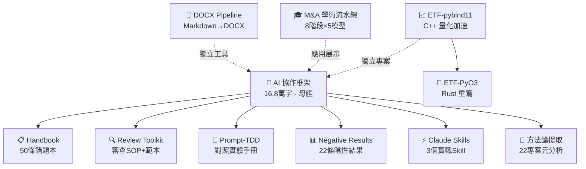

> [简体中文](README.md) | [English](README.en.md) | 正體中文

### Hi, I'm redamancy231 👋

**我構建可再現的人類-AI協作框架、量化工程工具和多模型 LLM 審查管道。**

11 個倉庫均經過跨模型獨立審查的實戰驗證。

所有倉庫均為三語（zh-CN / zh-Hant / EN），每種語言獨立檔案，透過語言欄交叉連結。

---

## 🚀 專案

### 方法論

| 專案 | 簡介 | 狀態 |
|------|------|:--:|
| [**AI 協作框架**](https://github.com/redamancy231-create/ai-collaboration-framework) | 人類-AI協作全生命週期方法論 — 3 次對照實驗 + 50+ 輪跨後端審查 | active |
| [**Methodology Handbook**](https://github.com/redamancy231-create/methodology-handbook) | 50 條實戰踩坑速查手冊 — AI 協作框架的「錯題本」伴侶 | published |
| [**Prompt-TDD Methodology**](https://github.com/redamancy231-create/prompt-tdd-methodology) | Prompt 對照實驗案例手冊 — 含兩個真實實驗結果（陰性結果公開） | published |
| [**M&A Case Study Pipeline**](https://github.com/redamancy231-create/ma-case-study-pipeline) | 8 階段多模型學術流水線 — 交叉雙盲審 + 開卷/盲答對照實驗 | demo |
| [**方法論提取方法論**](https://github.com/redamancy231-create/methodology-extraction-methodology) | 元層次方法論提取實驗 — 從22個專案中系統提取可復用方法論模式 | maintenance |

### 審查與品質保證

| 專案 | 簡介 | 狀態 |
|------|------|:--:|
| [**Independent Review Toolkit**](https://github.com/redamancy231-create/independent-review-toolkit) | 多模型獨立審查 SOP · Prompt 範本 · 對抗式挑戰框架 | published |
| [**Negative Results Registry**](https://github.com/redamancy231-create/negative-results-registry) | AI 協作陰性結果登記冊 — 22 條目 × 10 領域，結構化「AI 實驗失敗了」資料庫 | active |

### 開發工具

| 專案 | 簡介 | 狀態 |
|------|------|:--:|
| [**DOCX Pipeline**](https://github.com/redamancy231-create/docx-pipeline) | Markdown → 高品質中文 DOCX — 雙後端 + Mermaid 渲染 + 4 套預設範本 | published |
| [**Claude Skills**](https://github.com/redamancy231-create/claude-skills) | 3 個實戰驗證的 Claude Code Skill — 工作階段交接 · CLAUDE.md 編寫 · 事前否決 | published |

### 量化工程

| 專案 | 簡介 | 狀態 |
|------|------|:--:|
| [**ETF Pattern Match — pybind11**](https://github.com/redamancy231-create/etf-pattern-match-pybind11) | pybind11/C++20 加速量化策略核心 — DTW 34x / 形態匹配 53x | published |
| [**ETF Pattern Match — PyO3**](https://github.com/redamancy231-create/etf-pattern-match-pyo3) | Rust/PyO3 重寫 ETF 形態匹配 — API 相容 C++ 原版，NRR-2026-023 C++ vs Rust 完整對比 | published |

---

> **實線** = 從 AI 協作框架中提取/衍生的子專案。**虛線** = 獨立工具或應用展示。

---

## 📖 從哪裡開始

- **剛接觸人類-AI 協作？** → [AI 協作框架](https://github.com/redamancy231-create/ai-collaboration-framework)
- **想快速查閱實戰踩坑經驗？** → [Methodology Handbook](https://github.com/redamancy231-create/methodology-handbook)
- **想設計 Prompt 對照實驗？** → [Prompt-TDD Methodology](https://github.com/redamancy231-create/prompt-tdd-methodology)
- **需要審查 SOP 和 Prompt 範本？** → [Independent Review Toolkit](https://github.com/redamancy231-create/independent-review-toolkit)
- **想看 AI 實驗中「什麼不 work」？** → [Negative Results Registry](https://github.com/redamancy231-create/negative-results-registry)
- **需要 Markdown → 中文 DOCX 轉換？** → [DOCX Pipeline](https://github.com/redamancy231-create/docx-pipeline)
- **需要實戰驗證的 Claude Code Skill？** → [Claude Skills](https://github.com/redamancy231-create/claude-skills)
- **對量化工程感興趣？** → [ETF Pattern Match — pybind11](https://github.com/redamancy231-create/etf-pattern-match-pybind11)（C++ 原版）或 [ETF Pattern Match — PyO3](https://github.com/redamancy231-create/etf-pattern-match-pyo3)（Rust 重寫）
- **用 LLM 搭建學術流水線？** → [M&A Case Study Pipeline](https://github.com/redamancy231-create/ma-case-study-pipeline)
- **想看方法論提取實驗？** → [方法論提取方法論](https://github.com/redamancy231-create/methodology-extraction-methodology)

---

## 📫 聯繫

- 💬 歡迎合作：可再現的 AI 輔助研究與量化工程工具
- 🐛 發現 bug 或有建議？在對應倉庫提 Issue
- ⭐ 如果我的專案對你有用，歡迎 Star

---

> [简体中文](README.md) | [English](README.en.md) | 正體中文